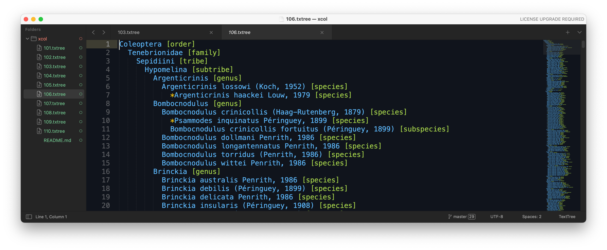
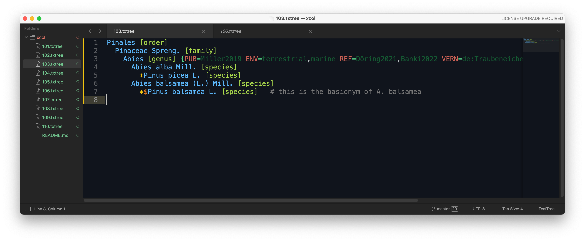

# TextTree format

TextTree is a simple format to represent taxonomic trees using indented, plain text.
It is recommended to use the file extension `.txt` or `.txtree`.

Each row in a TextTree represent a scientific name. 
Each name can include the authorship and should be given a rank following the name in angular brackets:

```
Abies alba Mill. [species]
```

All rank names are case insensitive, 
but must follow the [rank enumeration](https://github.com/gbif/name-parser/blob/master/name-parser-api/src/main/java/org/gbif/nameparser/api/Rank.java#L32) provided by the GBIF Name Parser.

The indentation level (strictly 2 spaces) and its upper rows
represent the classification:
```
Pinales [order]
  Pinaceae Spreng. [family]
    Abies [genus]
      Abies alba Mill. [species]
      Abies balsamea (L.) Mill. [species]
```

Synonyms are represented as direct, nested children that are prefixed by a `*` asterisk.
```
Pinales [order]
  Pinaceae Spreng. [family]
    Abies [genus]
      Abies alba Mill. [species]
        *Pinus picea L.
      Abies balsamea (L.) Mill. [species]
        *$Pinus balsamea L.
```
 
Basionyms can also be marked by prefixing the name with an additional `$` dollar symbol as in the `Pinus balsamea` example above.

Additional semi structured information can be given as key value pairs in curly brackets. 
Keys must be all upper case and are delimited with the value by the equality sign. Multiple values can be delimited by a comma.
Values should therefore not contain the reserved characters '=' and ','

```
  Abies alba Mill. [genus] {PUB=Miller2019 ENV=terrestrial,marine REF=Döring2021,Banki2022 VERN=de:Traubeneiche,fr:Chêne rouvre,dk:Vintereg,nl:Wintereik}
```

Comments can be given after each name or the dynamic info starting with a `#` symbol:
```
Pinales [order]
  Pinaceae Spreng. [family]
    Abies [genus]
      Abies alba Mill. [species]
        *Pinus picea L. [species]
      Abies balsamea (L.) Mill. [species] {PUB=Miller2019}  # need to verify the reference
        *$Pinus balsamea L. [species]   # this is the basionym of A. balsamea 
```


## Java package
The Java code provided allows to parse and print text trees. The [Tree class](src/main/java/org/gbif/txtree/Tree.java) offers 2 kind of parsed trees:

 1) A simple tree which keeps the parsed rank and the name incl authorship as it was given in a single string.
 2) A parsed tree which uses the [GBIF Name Parser](https://github.com/gbif/name-parser) to parse each name and provide in addition to the rank and name string
    also a ParsedName instance.
    
When parsing badly formatted trees the parser on purpose fails and does not try to read the remaining bits.


## Sublime syntax highlighting
We provide a [TextTree sublime package](sublime/TextTree/TextTree.sublime-syntax) that defines the syntax highlighting for the superb [Sublime Text](https://www.sublimetext.com) editor.
To use it simply copy the folder [TextTree](sublime/TextTree) into your sublime package folder, e.g. ```/Users/YOUR_NAME/Library/Application\ Support/Sublime\ Text\ 3/Packages``` on most Macs.
Or chose `Settings -> Browse Packages...` to let Sublime take you to your package folder.



