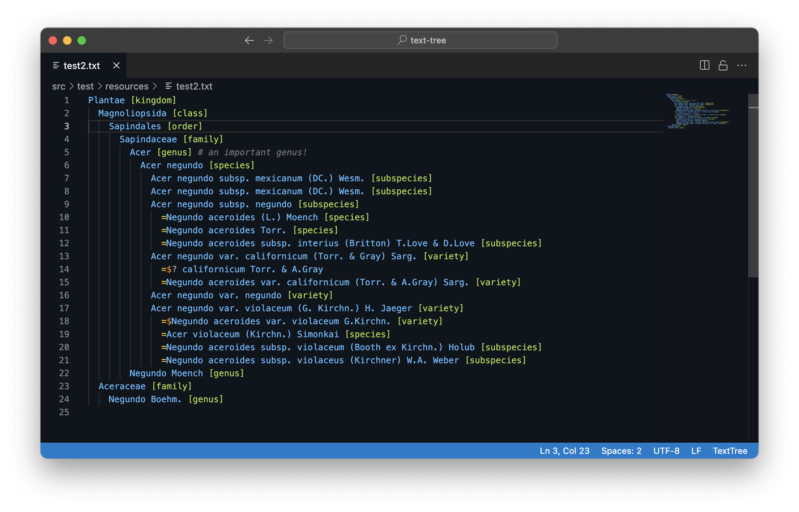

# TextTree format

TextTree is a simple format to represent taxonomic trees using indented, plain text.
It is recommended to use the file extension `.txt` or `.txtree`.

Each row in a TextTree represent a scientific name. 
Each name can include the authorship and should be given a rank following the name in angular brackets:

```
Abies alba Mill. [species]
```

All rank names are case insensitive, 
but must follow the [rank enumeration](https://github.com/gbif/name-parser/blob/master/name-parser-api/src/main/java/org/gbif/nameparser/api/Rank.java#L32) provided by the GBIF Name Parser.

The indentation level (strictly 2 spaces) and its upper rows
represent the classification:
```
Pinales [order]
  Pinaceae Spreng. [family]
    Abies [genus]
      Abies alba Mill. [species]
      Abies balsamea (L.) Mill. [species]
```

Synonyms are represented as direct, nested children that are prefixed by a `=` or `≡` 
if they are homotypic to the name directly above.
```
Pinales [order]
  Pinaceae Spreng. [family]
    Abies [genus]
      Abies alba Mill. [species]
        =Pinus picea L.
      Abies balsamea (L.) Mill. [species]
        ≡$Pinus balsamea L.
```
 
Basionyms can also be marked by prefixing the name with an additional `$` dollar symbol as in the `Pinus balsamea` example above.

This allows for rather rich synonymies being expressed:
```
Agoseris apargioides (Less.) Greene [species]
  ≡$Troximon apargioides Less. [species]
  ≡Barkhausia lessingii Hook. & Arn. [species]
  ≡Stylopappus lessingii D.Dietr. [species]
  =Macrorhynchus humilis Benth. [species]
  ≡Troximon humilis (Benth.) A.Gray [species]
  ≡Agoseris humilis (Benth.) Kuntze [species]
  =Agoseris maritima E.Sheld. [species]
  ≡Agoseris apargioides subsp. maritima (E.Sheld.) Q.Jones [subspecies]
  ≡Agoseris apargioides var. maritima (E.Sheld.) G.I.Baird [variety]
  =Agoseris maritima Eastw. [species]
  ≡Agoseris eastwoodiae Fedde [species]
  ≡Agoseris apargioides var. eastwoodiae (Fedde) Munz [variety]
```

Provisional names, e.g. with uncertain placement or lacking scrutiny, 
can be prefixed with a `?` to distinguish them from properly accepted names:
```
Agoseris Raf. [genus]
  Agoseris apargioides (Less.) Greene [species]
  ?Troximon humilis (Benth.) A.Gray [species]
```

The common convention to prefix extinct taxa with a dagger symbol is also supported:
```
Reptilia [class]
  †Bolosauria [order]
  Crocodylia [order]
    †Crocodylus megarhinus Andrews, 1905 [species]
      =†Crocodylus articeps Andrews, 1906 [species]
  †Dinosauria [order]
``` 

Additional semi structured information can be given as key value pairs in curly brackets. 
Keys must be all upper case and are delimited with the value by the equality sign. Multiple values can be delimited by a comma.
Values should therefore not contain the reserved character ','. If needed they can be escaped by doubling them, i.e. `,,` should be used to represent a comma in the value and `,,,,` for 2 commas.

```
  Abies alba Mill. [genus] {ID=1234 PUB=Miller2019 ENV=terrestrial,marine REF=Döring2021,Banki2022 VERN=de:Traubeneiche,fr:Chêne rouvre,dk:Vintereg,nl:Wintereik}
```

Comments can be given after each name or the dynamic info starting with a `#` symbol:
```
Pinales [order]
  Pinaceae Spreng. [family]
    Abies [genus]
      Abies alba Mill. [species]
        =Pinus picea L. [species]
      Abies balsamea (L.) Mill. [species] {PUB=Miller2019}  # need to verify the reference
        =$Pinus balsamea L. [species]   # this is the basionym of A. balsamea 
```

## ChecklistBank guide
[ChecklistBank](https://www.checklistbank.org) provides a small [publishing guide](https://catalogueoflife.github.io/coldp/docs/publishing-guide-txtree) for TextTree based datasets which defines a small set of info keys and a way to share structured references.


## Java package
The Java code provided allows to parse and print text trees. The [Tree class](src/main/java/org/gbif/txtree/Tree.java) offers 2 kind of parsed trees:

 1) A simple tree which keeps the parsed rank and the name incl authorship as it was given in a single string.
 2) A parsed tree which uses the [GBIF Name Parser](https://github.com/gbif/name-parser) to parse each name and provide in addition to the rank and name string
    also a ParsedName instance.
    
When parsing badly formatted trees the parser on purpose fails and does not try to read the remaining bits.


## Visual Studio Code Extension
We provide an extension for VS Code to do syntax highlighting.
It is available in the [VSCode Marketplace](https://marketplace.visualstudio.com/items?itemName=GBIF.texttree).
To install simply search the marketplace for the extension `TextTree`.

When installed files with the a file suffix `.txtree` and `.tree` should automatically make use of it.
Please make sure to also switch your color theme in your settings to the bundled `TextTree` theme.





## Sublime syntax highlighting
We also provide a [TextTree sublime package](https://github.com/gbif/text-tree-sublime) that defines the syntax highlighting for the [Sublime Text](https://www.sublimetext.com) editor.
To use it simply install it via the default [Package Control](https://packagecontrol.io/docs/usage) repository.


